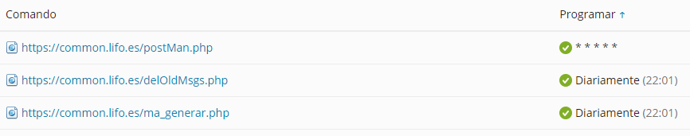

# Lifo.es

Código fuente del juego de rol online Lifo modificado por mi (Sora) durante los años 2017 a 2022.
Este código es una modificación del código base del juego original creado por [Luis Quesada Torres](https://github.com/lquesada).

El código original del juego se pueden encontrar en: [Código fuente](https://github.com/lquesada/LifoSource)

El Copyright de Lifo.es, así como sus distribuciones, se mantienen bajo la licencia descrita por el código fuente original.

Copyright (c) 2006-2013, Luis Quesada Torres - https://github.com/lquesada | www.luisquesada.com

&nbsp;&nbsp;

## Aspectos generales

El código fuente facilitado **NO ESTÁ PREPARADO NI LISTO** para su uso directo y requiere de varias modificaciones y preparaciones. Este repositorio se puede utilizar como base para la creación de un nuevo "Lifo" o partidas o lo que se desee.

Dentro de las carpetas facilitadas podemos encontrar:
  - **partida.lifo**: Contiene el código fuente para una partida. Parte de la última partida que se creó y con todas sus mejoras/cambios.
  - **partidaReyDeLaColina.lifo**: Contiene el código fuente para una partida modificada al estilo Rey de la colina. Son partidas finitas con cometencias, eventos y logros especiales a alcanzar por los jugadores.
  - **mainpage**: Contiene el código de la página principal selectora de partidas.
  - **img.lifo**: Contiene todas las imágenes del juego (objetos, monstruos, plantillas, imagenes de estructuras, etc).
  - **common.lifo**: Contiene el código de diversas funciones del juego tales como el borrado diario de mensajes, el cambio diario del mercader ambulante o el cartero de correos del juego.
  - **sql**: Scripts de creación de las tablas de la base de datos. Contiene:
    -  **game_database.sql**: Script sql de creación de tablas de una partida básica.
    -  **special_database.sql**: Script sql para crear la base de datos del cartero, mercader ambulante, etc...

La versión de **PHP** utilizada por el servidor debe 7.4 o mayor.

El lenguaje de base de datos utilizado es MySQL.

&nbsp;&nbsp;

## Crear una partida

Para crear una partida como mínimo se deben seguir estos pásos:
1. Copiar el contenido de la carpeta *partida.lifo* sobre la carpeta destino de la partida.
2. Crear una base de datos. Será donde almacenemos las tablas y datos del juego.
3. Sobre la base de datos, ejecutar el archivo *game_database.sql*.
4. Editar el archivo *w_config.php* rellenando todos los datos faltantes. Sobre este archivo deben de ir los datos de la partida, palabras secretas para encriptación, los datos de conexión a la base de datos y los datos del servidor de correo (muy importante esto último).
5. Una vez hecho esto, podemos como mínimo arrancar el servicio.
6. Ya arrancado, registramos un jugador y, desde la base de datos, lo hacemos administrador.

Hemos creado la partida y un jugador administrador, pero nos daremos cuenta de que no podemos entrar, eso se debe a que el usuario debe de verificar la cuenta con el correo de verificación. Por supuesto esto no funcionará porque todavía no hemos configurado esta funcionalidad. Vamos a ello:
1. Añadimos la carpeta common.lifo. Esta es la carpeta que almacena el gestor de correos (el cartero).
2. Deberemos, de nuevo, configurar el archivo *w_config.php* que trae.
3. Muy probablemente debamos editar archivos tanto en la partida creada como en *common.lifo* para que los archivos de correo a enviar (los *.html*) vayan a la carpeta correcta.

El funcionamiento del cartero se basa en: Generar un correo desde una partida en *.html* con un destinatario; Añadir ese correo a la carpeta uploads de cada partida; El cartero analiza cada carpeta uploads de cada partida y los saca de ahí para enviarlos.

El cartero no va a funcionar solo. Para que todo este mecanismo sea un trabajo asíncrono se requiere de una tarea de cron que ejecute el siguiente fichero:

Se debe ejecutar cada segundo el archivo *postMan.php*, que se encargará de dicho trabajo.

En las tareas programadas se pueden visualizar otras tareas, tales como:
 - **delOldMsgs.php**: Se encarga de borrar una vez al día todos los mensajes de más de 30 días de duración de todas las partidas.
 - **ma_generar.php**: Se encarga de generar una hora aleatoria y las orfertas diarias para el mercader ambulante de cada partida.

&nbsp;&nbsp;

Ya teniendo la partida y el cartero, será necesaria establecer la carpeta *img.lifo*, que contendrá las imágenes del juego. Muy importante recordar que la ruta esta carpeta se debe establecer en el archivo **w_config.php** siempre.

Relaizando los pasos anteriores y con una serie de modificaciones menores de rutas y demás aspectos, todo debería de funcionar. Recomiendo paciencia, es posible que no todo funcione a la primera, ya que hay que configurar bastantes aspectos.

&nbsp;&nbsp;

## Otros

Como se menciona anteriormente, también aporto el código base de una partida de el *Rey de la Colina*.

Concrétamente el código respectivo de la 2º partida del *Rey de la Colina*. También añado un sql llamado *reydelacolina_database.sql* que contiene la base de datos de este tipo de partida como fue la última.

Las partidas del tipo *Rey de la Colina* son partidas especiales finitas que buscan que los jugadores cumplan ciertos objetivos en ellas en un tiempo limitado. Estas partidas no cuentan con premium, clasificación u otros aspetos básicos del juego.

&nbsp;&nbsp;

## Agradecimientos

Quisiera agradecer a los jugadores que han participado en el juego a lo largo de estos años y a todo el mundo que a colaborado en el juego.

En especial me gustaría agradecer a:
 - Recycled, por haberme ayudado años con la moderación y creando imágenes para el juego.
 - Layon, jugador invidente que colaboró mucho con el juego.
 - Casio, un buen amigo que me ha acompañado en todo el camino toda la vida de lifo.es.
 - Y a todos los moderadores de los servidores a lo largo de todo este tiempo. De veras, gracias por todo.

Un saludo, y mucha suerte en vuestro camino.
Gracias por todos estos años.

Att: Sora 
